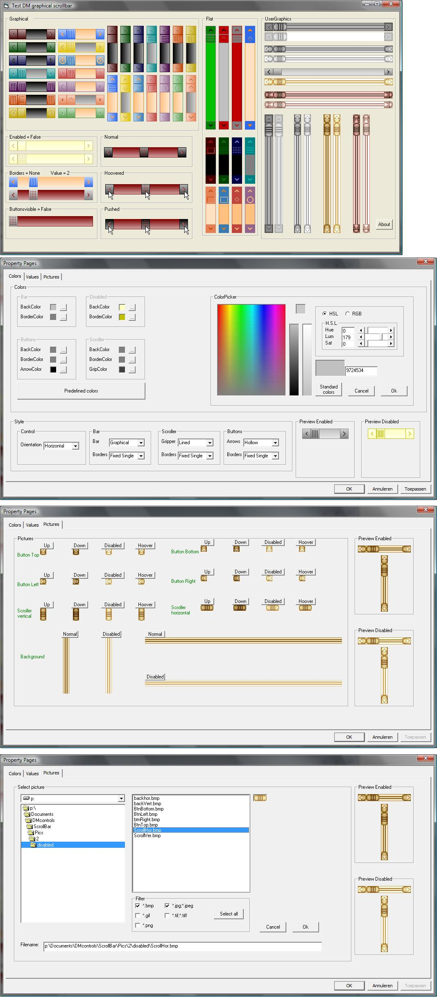



## DMscrollbar

### Description

This graphical scrollbar is a nice and cool replacement for the poor, boring standard scrollbar

Many different styles for the bar, buttons, arrows, ...

Possibility to set colours for background, buttons, ... separately

Possibility to set pictures for background, buttons(normal, pressed and hoover for buttons and scroller), ...

Possibility to set orientation to horizontal or vertical

Property pages for colours, predifined colours, pictures, styles and values

Pictures for a few bars included

Tested on Windows 7 / 2000 / XP / Vista
 
### More Info
 

             |
---                |---
**Submitted On**   |2010-04-05 11:52:34
**By**             |[Frank Donckers](https://github.com/Planet-Source-Code/PSCIndex/blob/master/ByAuthor/frank-donckers.md)
**Level**          |Advanced
**User Rating**    |4.9 (49 globes from 10 users)
**Compatibility**  |VB 6\.0
**Category**       |[Custom Controls/ Forms/  Menus](https://github.com/Planet-Source-Code/PSCIndex/blob/master/ByCategory/custom-controls-forms-menus__1-4.md)
**World**          |[Visual Basic](https://github.com/Planet-Source-Code/PSCIndex/blob/master/ByWorld/visual-basic.md)
**Archive File**   |[DMscrollba217861482010\.zip](https://github.com/Planet-Source-Code/frank-donckers-dmscrollbar__1-73059/archive/master.zip)

